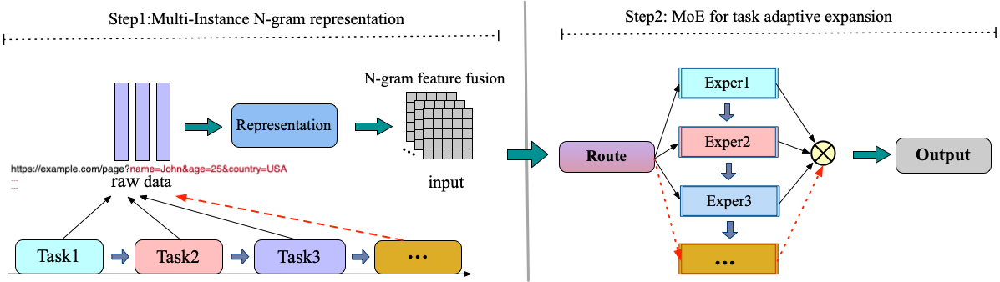

# NCA-MoE: Adaptive multi-task continual learning for web security detection via N-gram channel attention mixture of experts

[](https://github.com/your-username/NCA-MoE)
[](LICENSE)
[](https://python.org)
[](https://pytorch.org)

> **🚧 Repository Status: Code and data are being organized and will be uploaded soon.**

## 📋 Overview

**NCA-MoE** (N-gram Channel Attention Mixture-of-Experts) is a novel adaptive multi-task continual learning framework designed for scalable web security detection with strong anti-forgetting capabilities. Our framework addresses the critical challenge of catastrophic forgetting in web threat detection systems operating in dynamic environments.

### 🎯 Key Features

- **🧠 Multi-Instance N-gram Representation**: Character-level N-gram feature extraction (1-gram to 5-gram) with miVLAD aggregation
- **🎨 NCA-Net Expert Architecture**: Channel attention mechanisms with Selective Kernel Networks (SKNet) for dynamic feature selection
- **⚡ Adaptive Mixture-of-Experts**: Dynamic expert expansion with intelligent gating mechanisms
- **🛡️ Strong Anti-Forgetting**: Parameter isolation and proportional sample replay for robust knowledge retention
- **📊 Superior Performance**: Achieves 0.9942±0.0029 anti-forgetting score, significantly outperforming existing methods


## 🗂️ Dataset Coverage

Our framework is evaluated on five representative web security datasets:

- **CSIC-2010**: SQL injection and XSS attacks (35,586 entries)
- **ECML-PKDD 2007**: Malicious bot detection (21,063 entries)  
- **ISCX-Defacement**: Website defacement attacks (192,914 entries)
- **ISCX-Malware**: Malware-generated traffic (65,040 entries)
- **ISCX-Phishing**: Phishing attack detection (188,214 entries)

## 🏗️ Architecture



## 🛠️ Installation

### Prerequisites

- Python 3.8+
- PyTorch 1.8+
- CUDA 10.2+ (for GPU support)

### Quick Setup

```bash
# Clone the repository
git clone https://github.com/your-username/NCA-MoE.git
cd NCA-MoE

# Create virtual environment
python -m venv nca_moe_env
source nca_moe_env/bin/activate  # On Windows: nca_moe_env\Scripts\activate

# Install dependencies
pip install -r requirements.txt
```

## 🚀 Quick Start

```python
from models.nca_moe import NCAMoEFramework
from utils.data_loader import WebSecurityDataLoader

# Initialize the framework
model = NCAMoEFramework(
    input_dim=500,
    ngram_dim=5, 
    hidden_dim=1024,
    output_dim=2
)

# Load and preprocess data
data_loader = WebSecurityDataLoader()
train_data = data_loader.load_dataset('CSIC-2010')

# Train the model
model.continual_train(train_data, task_id=1)

# Evaluate anti-forgetting performance
af_score = model.evaluate_anti_forgetting(test_data)
print(f"Anti-Forgetting Score: {af_score:.4f}")
```


## 📝 Citation

If you find our work useful for your research, please consider citing:

```bibtex
@article{wait for the article accept hah,
  title={NCA-MoE: An Adaptive Multi-task Continual Learning Framework for Network Threat Detection with Strong Anti-forgetting Capability},
  author={Zhang, Jiachen},
  journal={Journal of Information Security and Applications},
  year={2025},
  institution={School of Cyberspace Security, Beijing University of Posts and Telecommunications}
}
```

## 📧 Contact

- **Primary Author**: Jiachen Zhang
- **Institution**: School of Cyberspace Security, Beijing University of Posts and Telecommunications
- **Email**: [jiachen.zhang@bupt.edu.cn]

For questions about the paper or implementation, please:
1. Open an issue in this repository
2. Contact the authors via email
3. Join our discussion forum (coming soon)

## 🙏 Acknowledgements

We thank the contributors of the datasets used in our evaluation:
- CSIC-2010 HTTP Dataset
- ECML/PKDD 2007 Challenge Dataset  
- ISCX-2016 Dataset Collection
---

⭐ **Star this repository if you find it helpful!** ⭐

**Note**: This repository is actively maintained. Code and datasets will be uploaded progressively as we finalize the organization and documentation.
